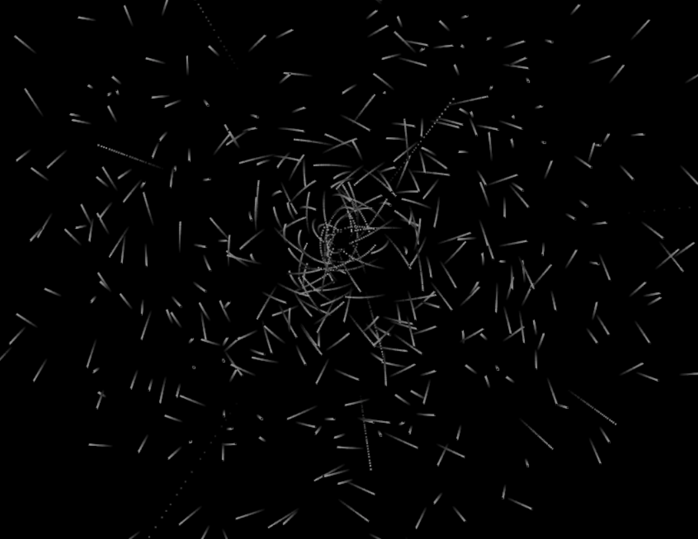

# playing around with Gravity

A large mass in the origin, and a load of particles.  see what happens.



some noteable parameters to change,

index.js

```javascript
const tmax = 30;            // length of trail
const spread = 500;         // spread of bodies
const total = 500;          // total number of bodies
const v_spread = 50;        // spread of velocity
const m_spread = 100;       // mass spread
const m_black_hole = 50000; // the black hole!
```

and the gravity law,

phys.js

```javascript
const G = 100000;           // somewhat scaled G...
```

make the changes and refresh the browser page.

## controls

mouse wheel soom in/out, right click and drag to move around.
